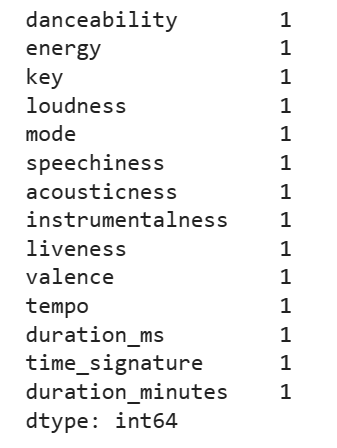
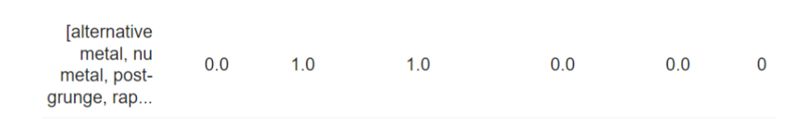
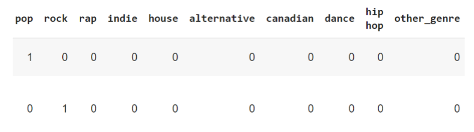
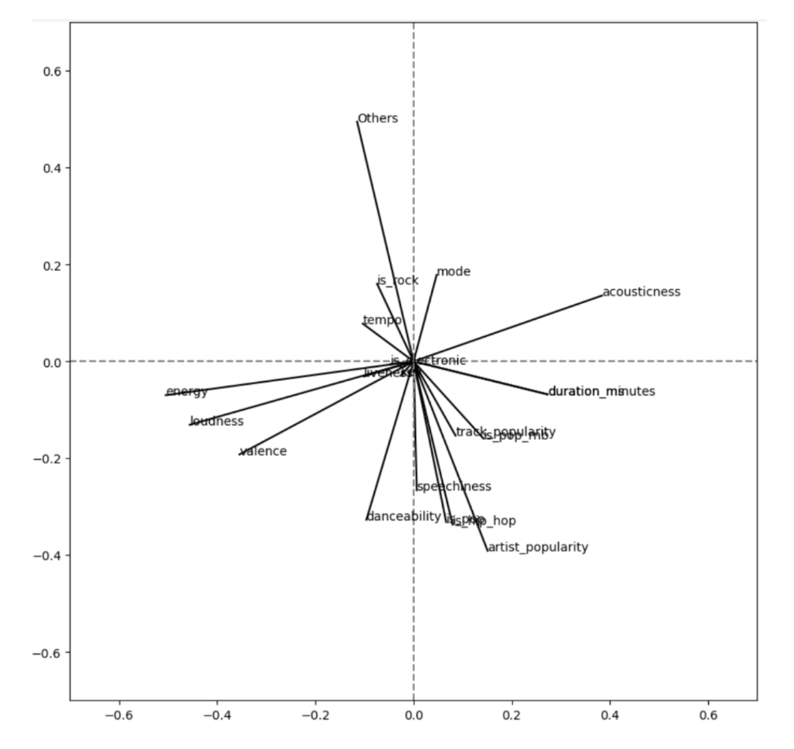
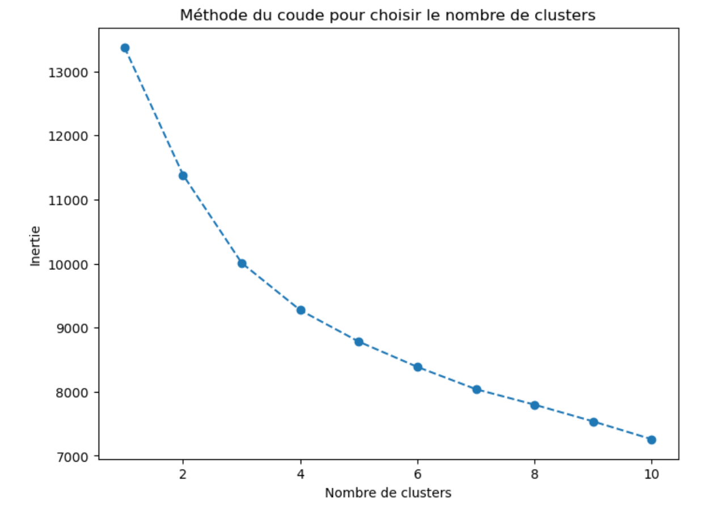
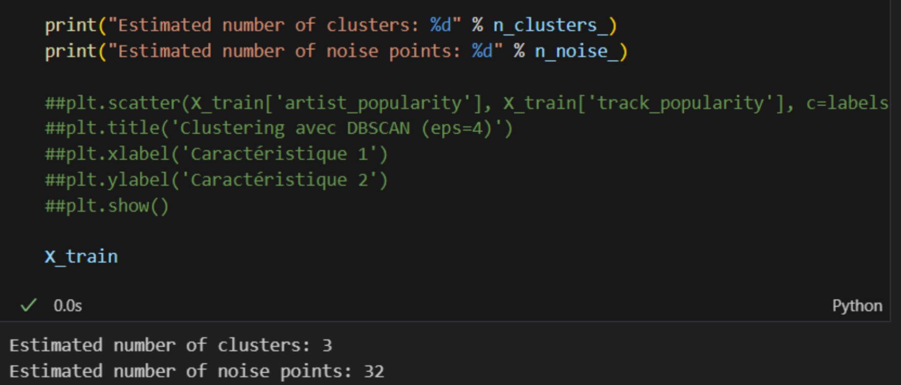

**Rapport Laboratory 1: Spotify top tracks**

Ricardo FERNANDEZ | Sarra MAHMOUDI | Chenjie QIAN | Soumiya RAZZOUK | Daniel TERAN

# **Dataset understanding** 

## **General Description of the dataset    1 page**
It includes information on songs/tracks (100 per year) from Top Hit playlists from 2000 to 2022 created by Spotify with: 2300 attributes and 23 variables where: 

- Year feature as ratio type feature
- There are 13 track’s audio features (ratio type).
- Other 9 nominal features (playlist\_url, track\_id, track\_name, track\_popularity, album, artist\_id, artist\_name, artist\_genre, artist\_popularity)
##
## **Feature definition**

- ## **Correlation matrix**
In this analysis, the strongest positive correlation is between danceability and energy (0.4) and the strongest negative correlation is between acousticness and energy (-0.54). In general, the correlation between the features is between 0.25 and -0.25, so there are no significant conclusions about the data.

- ## **Nominal analysis**
As numerical data has no significant conclusions, we’ve explored the nominal data of the artist genre in order to count them and extract numerical information from it. In this case, we’ve found that there are 437 genres registered in the whole dataset. We’ve done a categorization of it in just the top ten words that are repeated in genre features. All the other genres were classified as “Other”. In that way we’ve plotted the evolution of artist genres through the time:

We found that the pop genre is the biggest one in % through the time, followed by rap. There is a strong increase of the pop genre and others like “alternative and dance has almost disappeared in 2023. This information is useful to correlate this new numerical genre data to the other features such as popularity and energy for example, and find new valuable information.

**In other analysis,** we’ve explored the evolution of the data to conclure:

- The number of artists by year has a slow decrease, it’s possible to determine if the top ten songs have changed to be concentrated in fewer artists.
- The number of albums has increased a few, but it’s not clear that there is a tendency. 
- It’s clear that the mean duration track has decreased over the years, almost in a constant rhythm from 4.1 to 3.3 minutes. Also, just 20% of the music is more than 4 minutes long. At the PCA analysis is interesting to see the relation between popularity and duration track.
# **3. Data preparation :** 
1. In the data preparation phase, we worked with a dataset consisting of 2300 rows. Initial inspection revealed the presence of only one column with missing values, and the decision was made to drop it, as no further processing was deemed necessary. 
1. Additionally, a crucial step of normalization was carried out to ensure that all features were on the same scale. Specifically, relevant numeric columns were selected, including information about song popularity, technical features, and other key metrics. Normalization was performed using the StandardScaler to center and scale these features, which will enhance the performance of machine learning algorithms used in subsequent analysis. This data preparation process provides a solid foundation for further data exploration and modeling.

1. ## **Cleaning error data**

Initially, we used the isnull() method to detect null values within the Dataset, and then we employed the dropna(axis = 0) method to remove them.

|<h1></h1>|<h1></h1>|
| :- | :- |
|Before cleaning|After cleaning|

1. **Normalization :** 

First, we iterate through all the keywords in the "artist genres," organize them, and finally categorize them. Based on the collective keywords, we have divided them into six major categories: pop, rock, hip-hop, electronic, and others. We have developed a function that determines the category based on keywords. If an artist belongs to a particular category, the corresponding cell is marked as 1; otherwise, it is marked as 0. If an artist does not belong to any category, they are classified as "Others."

To facilitate better comparison, we have employed an alternative classification method based on keyword capture. This classification is mutually exclusive, meaning that once an artist belongs to a particular category, we consider them as not belonging to any other category. This approach differs from the previous normalization method. We anticipate that it will help us discover more information.

# **4. Data modeling :**
1. ## **PCA:** 
PCA is based on cleaned data, and we have compared the results obtained using two different normalization methods.

|Non-exclusive|Exclusive|
| :-: | :-: |
|||
|||

Due to the relatively low correlation between the data, regardless of the method used, the combined proportion of the first and second principal components does not exceed 40%. Moreover, to achieve a cumulative proportion of over 90%, it appears that we would need to retain nearly as many components as the number of variables we have. This indicates that in this scenario, PCA may not be effective in reducing the dimensionality of the data.

Nevertheless, through the use of these two different methods, we can still draw some interesting conclusions. It's evident that the popularity of a track and the popularity of the artist are highly correlated, which is an intuitive finding. Pop and hip-hop appear to be the two most popular music genres as they align closely on the graph, with a small angle between them. Conversely, rock points in the opposite direction, suggesting that it may not be as popular. Considering other variables, such as energy and loudness, they appear to be nearly orthogonal to the popularity of the track. This suggests that there is little to no correlation between energy, loudness, and track popularity.

1. **Clustering :** 

For the clustering analysis, we experimented different approaches : 

- Elbow Method for determining the optimal number of clusters.

For the clustering analysis, we experimented with two different approaches:

- Elbow Method for determining the optimal number of clusters.

- Agglomerative Clustering.

- Dendrogram visualization.

- DBScan method with parameters eps=4 and min\_samples=4.

AgglomerativeClustering : 

Dendogram representation : 

DBScan method : with an eps = 4 and min\_samples = 4

DBSCAN predicts that we have 3 clusters within our data.

In this context of large-scale data, the use of these clustering methods is not very efficient. It is better to explore clustering patterns based on the year and the music gender, instead.

# **Conclusion**

The purpose of this report was to perform an analysis using unsupervised machine learning techniques on the database of the most listened-to songs of each year from 2000 to 2022. Initially, data understanding was conducted by exploring the dataset, examining simple data statistics, and searching for direct correlations using a correlation matrix. Subsequently, data was prepared to ensure its usability for the proposed techniques. PCA analysis revealed interesting correlations that were not evident during the initial correlation matrix, such as the inverse relationship between popularity and having an alternative genre. Two clustering techniques were also applied, utilizing the elbow method and DBScan, to identify subgroups and gain more insights.

From the results obtained, the following conclusions can be drawn:

\- No evident correlations were found in the raw data.

\- It is understandable that there is not a significant relationship between songs with a 20-year age difference, given the rapidly changing nature of the music industry and trends.

\- Pop is the dominant genre and has a direct correlation with both artist and song popularity, as well as a negative relationship with alternative genres labeled as "others."

\- Clustering music is a complex task, primarily due to the industry's long history and constant evolution.

\- Obvious correlations were identified between song characteristics, such as energy and acousticness, as well as a potential relationship between song duration and popularity, although not very evident.

In summary, this analysis provided valuable insights into the relationships and characteristics of songs over the years, which can be useful for a better understanding of music dynamics over the past decades.
